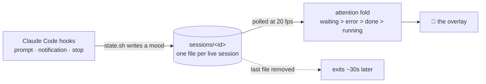

<div align="center">

# 🐣 Perchling


**A tiny pixel creature that perches on the corner of your screen and reacts to
Claude Code — so you can look away from the terminal and still know when it
needs you.**

[](LICENSE)
[](#-install)
[](#-how-it-works)
[](#-how-it-works)
[](https://github.com/zexion7873/perchling/stargazers)
[](https://github.com/zexion7873/perchling/commits)

No Electron. No WebSocket server. No log scraping. One native Swift binary,
driven straight off Claude Code hook events.

</div>

---

## 🚀 Install

### 🤖 Hand it to your agent

Paste this and walk away:

```text
Fetch and follow https://raw.githubusercontent.com/zexion7873/perchling/main/llms-install.md
```

It runs the preflight, installs from the CLI, and launches the pet on the spot
instead of leaving you to wait for your next session. Recipe in
[llms-install.md](llms-install.md).

### 🧑 Or type it yourself

From inside a Claude Code session:

```text
/plugin marketplace add zexion7873/perchling
/plugin install perchling@perchling
```

The pet appears on your next session and builds itself from source on first
launch — a few seconds, once.

> [!IMPORTANT]
> **Requirements:** macOS with Xcode Command Line Tools (`xcode-select --install`).
> On every other platform the plugin stays silently inactive rather than erroring.

---

## 🎭 What it does

|   | State | Trigger | What you see |
|:-:|-------|---------|--------------|
| ⌨️ | **running** | you submit a prompt, tools execute | bounces, glances around, types a line out on its belly |
| 👀 | **waiting** | permission prompt, a question for you, a plan to approve | stops and stares straight at you, twitching |
| 🎉 | **done** | turn or agent completed | hops under a twinkle, waves, then settles |
| 😢 | **error** | an API failure ended the turn | droops, and a tear rolls off its chin |
| 💤 | **idle** | nothing happening | breathes slowly, blinks |

Its eyes follow your cursor. Hover it and it startles. Click it and it hops,
then throws you back to Claude — the desktop app if that's running, otherwise
whatever was frontmost when the pet launched.

Drag it anywhere; the position sticks. Right-click for **Tuck away** (hides
until something needs you), **Disable**, or **Quit**.

### 💬 The speech bubble

A pixel bubble above its head shows what it's doing over a line of context:
your prompt while it works, then a snippet of Claude's reply once the turn
ends. The status words are translated for Chinese and Japanese systems and read
English everywhere else. It's a click-through overlay, so it never steals a
click, and it vanishes when things go idle.

A small disc perches on the pet's shoulder while there is anything to say.
Click it to fold the bubble away or bring it back — the choice sticks across
restarts. When something happened while you were looking elsewhere, the disc
turns into a count of how much you missed; coming back to Claude, or opening
the bubble, clears it.

### 🔔 When you've looked away

**waiting**, **done** and **error** each post a macOS notification with a
chirp — but only while you're in another app. Look at Claude and it shuts up.

> [!NOTE]
> macOS attributes these notifications to "Script Editor". Allow them when the
> first one asks, or they're dropped silently.

### 🗂️ With several sessions open

It shows the most attention-worthy state across all of them — **waiting >
error > done > running** — so one chatty session can't drown out another that
actually needs you. Stale moods expire on their own, so a session killed
mid-flight can't leave the pet bouncing forever. It honours the system Reduce
Motion setting throughout.

---

## 🎨 Custom pets

Don't like the creature? Ask Claude for a different one:

```text
draw me a cat pet
```

The bundled `draw-pet` skill has Claude design a **`pet.json`** — a palette
plus one pixel grid per mood — validate it, and install it. The pet transforms
live within a second. No rebuild, no restart, no image files.

```json
{
  "name": "sprout",
  "scale": 2,
  "palette": { "b": "#61b56b", "o": "#244a2e", "k": "#1d3524" },
  "moods": { "idle": ["..bbbb..", ".bobbob.", ".bbkkbb.", "..bbbb.."] }
}
```

A pet is one JSON file, so sharing one is sending one file. Your pets live in
`~/.claude/perchling/pets/`, and `pet.json` is a symlink to whichever one is
active — **right-click the pet and open Pets** to switch, or to go back to the
built-in. The examples that ship with the plugin are listed there too, and get
copied into your library the first time you pick one. Two worked examples ship
in [`examples/`](examples/): a leafy slime, and the built-in creature itself.
The format lives in [`skills/draw-pet/SKILL.md`](skills/draw-pet/SKILL.md).

> [!TIP]
> `scale` is the sharpness dial. A small grid at `"scale": 4` gives the chunky
> retro look; a grid twice as wide at `"scale": 2` fills about the same corner
> of your screen with four times the detail.

Remix the default instead of starting from a blank grid. Writing it straight
into the library puts it in the menu:

```bash
~/.claude/perchling/bin/perchling --export > ~/.claude/perchling/pets/mine.json
```

Delete `~/.claude/perchling/pet.json` and the built-in creature comes back,
live — which is exactly what the menu's **Built-in perchling** row does.

> [!WARNING]
> A manifest carries pixels, not behaviour. An exported pet loses the default's
> cursor-following pupils, its blink, its blinking terminal cursor and its wave,
> and its sideways twitch moves the whole body rather than just the eyes.

---

## 🔧 How it works



Each session's mood is a file, and the same file is the liveness refcount —
re-stamped on every prompt, removed when the session ends. That's the whole
protocol: no IPC, no daemon framework, and no network traffic at runtime.

---

## 🎛️ Controls

The control script lives inside the installed plugin, and that path changes on
every update — resolve it once:

```bash
pet=$(find "${CLAUDE_CONFIG_DIR:-$HOME/.claude}/plugins" -type f -path '*perchling*/scripts/pet.sh' | head -1)
```

```bash
bash "$pet" status    # binary / process / state / session count
bash "$pet" build     # force a rebuild
bash "$pet" stop      # drop refcounts and kill the pet
bash "$pet" disable   # keep it off across sessions
bash "$pet" enable    # bring it back
bash "$pet" wake      # un-tuck a tucked pet
```

```bash
echo -n waiting > ~/.claude/perchling/state   # puppeteer it yourself
```

---

## 🧹 Uninstall

```text
/plugin uninstall perchling@perchling
```

Then `rm -rf ~/.claude/perchling` to remove the binary and its state.

---

## ⚖️ Disclaimer

Unofficial community project. Not affiliated with, endorsed by, or sponsored by
Anthropic or OpenAI.

The built-in creature is not a drawing at all — it is composed at runtime from
rounded rectangles and spikes, with its shading derived from neighbouring
pixels. The source code *is* the source art.

## 📄 License

[MIT](LICENSE)
