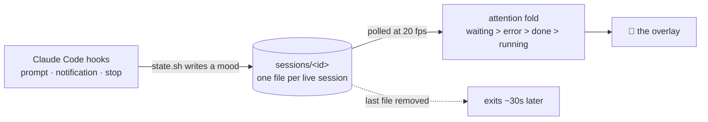

<div align="center">

# 🐣 Perchling


**A tiny pixel creature that perches on the corner of your screen and reacts to
Claude Code — so you can look away from the terminal and still know when it
needs you.**

[](LICENSE)
[](#-install)
[](#-how-it-works)
[](#-how-it-works)
[](https://github.com/zexion7873/perchling/stargazers)
[](https://github.com/zexion7873/perchling/commits)

No Electron. No WebSocket server. No log scraping. One native Swift binary,
driven straight off Claude Code hook events.

</div>

---

## 🚀 Install

### 🤖 Hand it to your agent

Paste this and walk away:

```text
Fetch and follow https://raw.githubusercontent.com/zexion7873/perchling/main/llms-install.md
```

It runs the preflight, installs from the CLI, and launches the pet on the spot
instead of leaving you to wait for your next session. Recipe in
[llms-install.md](llms-install.md).

### 🧑 Or type it yourself

From inside a Claude Code session:

```text
/plugin marketplace add zexion7873/perchling
/plugin install perchling@perchling
```

The pet appears on your next session and builds itself from source on first
launch — a few seconds, once.

> [!IMPORTANT]
> **Requirements:** macOS with Xcode Command Line Tools (`xcode-select --install`).
> On every other platform the plugin stays silently inactive rather than erroring.

---

## 🎭 What it does

|   | State | Trigger | What you see |
|:-:|-------|---------|--------------|
| 👁️ | **running** | you submit a prompt, tools execute | hunches over a laptop and works |
| 👀 | **waiting** | permission prompt, a question for you, a plan to approve | stops and stares straight at you, wide-eyed, twitching |
| 🎉 | **done** | turn or agent completed | sits up grinning, ears perked |
| 😢 | **error** | an API failure ended the turn | droops, a red cross through each eye |
| 💤 | **idle** | nothing happening | sits and breathes, tail curled |

Drag it and it leans into the pull, feet planted, and rights
itself when you let go. Click it and it hops, then throws you back to Claude —
the desktop app if that's running, otherwise whatever was frontmost when the pet
launched.

Drag it anywhere; the position sticks. Right-click for **Tuck away** (hides
until something needs you), **Disable**, or **Quit** — Controls below has which
is which.

### 💬 The speech bubble

A bubble above its head shows what it's doing over a line of context: your
prompt while it works, then a snippet of Claude's reply once the turn ends. With
more than one session open it names the session it is quoting, and that is the
same session the face picked among the live ones, so the two cannot describe
different windows. The status words are translated for Chinese and Japanese
systems and read English everywhere else. It's a frosted, click-through
overlay, so it never steals a click, and it stays up through idle rather than
folding itself away.

A small disc sits beside the top of its head, right edge flush with the
bubble's above it. Click it to fold the bubble away or bring it back — the
choice sticks across restarts. When something happened while you were looking elsewhere, the disc
turns into a count of how much you missed; coming back to Claude, or opening
the bubble, clears it.

### 🔔 When you've looked away

**waiting**, **done** and **error** each post a macOS notification with a
chirp — but only while you're in another app. Look at Claude and it shuts up.

> [!NOTE]
> macOS attributes these notifications to "Script Editor". Allow them when the
> first one asks, or they're dropped silently.

### 🗂️ With several sessions open

It shows the most attention-worthy state across all of them — **waiting >
error > done > running** — so one chatty session can't drown out another that
actually needs you. **Right-click to see which is which:** every live session
gets a row named after the title shown in the app's sidebar, falling back to
the CLI's own name for the session, then its project directory, plus what
it's doing — the one that wants you first.

```
perchling — waiting for you…
dotfiles — thinking…
scratch — chilling…
```

Two rows that would otherwise show the same name get a short ` · id`
appended so you can still tell them apart.

Clicking a row brings Claude forward, the same as tapping the pet — individual
terminal tabs aren't addressable from an accessory app, so it doesn't pretend
to jump you there. Stale moods expire on their own, so a session killed
mid-flight can't leave the pet bouncing forever. It honours the system Reduce
Motion setting throughout.

---

## 🎨 Custom pets

Don't like the creature? Ask Claude for a different one:

```text
draw me a cat pet
```

The bundled `draw-pet` skill has Claude design a **`pet.json`** — a palette
plus one pixel grid per mood — validate it, and install it. The pet transforms
live within a second. No rebuild, no restart, no image files.

```json
{
  "name": "sprout",
  "scale": 2,
  "palette": { "b": "#61b56b", "o": "#244a2e", "k": "#1d3524" },
  "moods": { "idle": ["..bbbb..", ".bobbob.", ".bbkkbb.", "..bbbb.."] }
}
```

> [!TIP]
> `scale` is the sharpness dial. A small grid at `"scale": 4` gives the chunky
> retro look; a grid twice as wide at `"scale": 2` fills about the same corner
> of your screen with four times the detail.

The format lives in [`skills/draw-pet/SKILL.md`](skills/draw-pet/SKILL.md).

### 👁️ Eyes that follow

Add an optional `eyes` block and a pet stops staring straight ahead: its eyes
drift toward the cursor while it waits, and blink on their own.

```json
"eyes": { "box": [32, 44, 39, 24], "socket": "i" }
```

`box` is `[x, y, width, height]` around the eyes and `socket` the palette key
behind them — the color the vacated pixels take when the eyes move, so the box
has to sit on a flat field. `range` (default 2) is how far they travel and
`lid` overrides the blink color, which is otherwise picked from the box.
`perchling --validate` reports the box it read and what it could build from it.

`"range": 0` is worth knowing about: it buys the blink and switches the gaze
off. Use it when the eyes have no flat margin to slide into, because the blink
repaints the whole box and so needs no margin at all, while a gaze with nowhere
to go smears the face instead.

### 🎞️ Anything that needs more than one frame

A mood is a single grid, so everything that moves lives in a top-level
`sequences` block of its own rather than inside `moods`:

```json
"sequences": {
  "hover": { "frames": ["...", "..."], "steps": [[0, 150], [1, 150]], "plays": 2 },
  "drag":  { "frames": ["...", "..."], "steps": [[0, 100], [1, 100]], "mirror": true },
  "tap":   { "frames": ["...", "...", "..."], "steps": [[0, 140], [1, 140], [2, 280]] },
  "done":  { "frames": ["...", "..."], "steps": [[0, 280], [1, 110], [0, 140]] }
}
```

`steps` is the animation and it is required. Each entry is `[frame, ms]` — "draw
this frame, hold it this long" — so `frames` is just a pool of poses whose order
means nothing. A pose may appear more than once with a different hold, which is
what `done` does above: three beats off two drawings. Durations round to the
50ms tick, and `perchling --validate` prints the timeline it actually built.

Three of the names are reactions: `hover` plays when the cursor arrives, `drag`
loops while the pet is held, and `tap` plays when the pet is clicked — a pet
that ships `tap` frames replaces the little hop every pet does by default.
`"plays": 2` on `hover` or `tap` runs the timeline twice — a double hop off one
copy of the art — and it means nothing on anything that already loops until
something else stops it. The other five are the moods themselves —
`idle`, `running`, `waiting`, `done`, `error` — and naming one makes that mood
animate, looping for as long as the pet is in it and starting over when it
arrives. Every one is optional and independent. The mood's own grid in `moods`
stays required either way: it is what shows while macOS Reduce Motion is on.

Draw `drag` facing right and add `"mirror": true` only if your pet may be
reflected — the renderer then flips the frames while the drag heads left, which
buys a second facing for no extra pixels, but it also reverses a badge or
lettering, so it is yours to grant. On anything else `mirror` does nothing;
a burst and a resting state have no direction of travel.

> [!WARNING]
> A manifest carries pixels, and what it can say about them is where the eyes
> are and which frames animate. Declare `eyes` and a pet gets the
> cursor-following gaze and a blink; without it, neither. Declare `sequences`
> and it gets the reactions and mood loops you named; a pet that ships no
> `hover` frames has no hover reaction at all. The two do not stack: a playing
> sequence takes the body over, so a mood you animate is a mood that stops
> tracking the cursor and stops blinking — `waiting` is the only mood that had
> either, so it is the only one where the choice costs anything.
> The sideways twitch moves the whole body rather than just the eyes.
> The drag lean works on any pet — it bends the pixels that are already there.
>
> The built-in is a manifest like any other, so all of this applies to it too,
> and it is the pet that spends the whole trade above rather than dodging it. It
> declares all eight sequences — every mood, plus `hover`, `drag` and `tap`,
> with `"mirror": true` on the drag — and it declares no `eyes` at all. So it
> never follows your cursor and never blinks, and in exchange every mood moves.
> `perchling --export` prints it, so the worked example for every one of these
> blocks is one command away.

### 📚 Your pet library

A pet is one JSON file, so sharing one is sending one file. Your pets live in
`~/.claude/perchling/pets/`, and `pet.json` is a symlink to whichever one is
active — **right-click the pet and open Pets** to switch, or to go back to the
built-in. The examples that ship with the plugin are listed there too, and get
copied into your library the first time you pick one. Five ship in
[`examples/`](examples/), all of them animals that animate every mood and every
reaction, `drag` included — `otter` and `chinchilla` on land, `whale`, `shark`
and `sea-lion` in the water. The husky is not among them because it is the
built-in; `--export` is how you get its manifest.

Remix the default instead of starting from a blank grid. Writing it straight
into the library puts it in the menu:

```bash
mkdir -p ~/.claude/perchling/pets
~/.claude/perchling/bin/perchling --export > ~/.claude/perchling/pets/mine.json
```

Delete `~/.claude/perchling/pet.json` and the built-in creature comes back,
live — which is exactly what the menu's **Built-in perchling** row does.

---

## 🔧 How it works



Each session's mood is a file, and the same file is the liveness refcount —
re-stamped on every prompt, removed when the session ends. That's the whole
protocol: no IPC, no daemon framework, and no network traffic at runtime.

---

## 🎛️ Controls

Right-click the pet for its menu. Three entries make it go away, and the
difference is not how firmly you close it — it is how long it stays gone and
what is allowed to bring it back:

| | The process | What brings it back |
|---|---|---|
| **Tuck away** | keeps running, just hidden | **itself**, the moment a session starts waiting on you or hits an error — or `pet.sh wake` |
| **Quit perchling** | ends | the next session you start |
| **Disable** | ends, and leaves a marker behind | **only you**, with `pet.sh enable` |

Tuck and Quit look the same on screen and are not: a tucked pet is still
running and still watching your sessions, which is the only reason it can decide
to come back on its own. Quit leaves nothing watching, so it waits for the next
session to start it.

Disable is the one with a memory. Every session start checks for that marker
first and leaves the pet alone, so it stays gone across restarts, reboots and
new projects until you take the marker away — `pet.sh wake` will not override
it either, and says so.

The control script lives inside the installed plugin, and that path changes on
every update — resolve it once:

```bash
pet=$(find "${CLAUDE_CONFIG_DIR:-$HOME/.claude}/plugins" -type f -path '*perchling*/scripts/pet.sh' | head -1)
```

```bash
bash "$pet" status    # binary / process / state / session count
bash "$pet" build     # force a rebuild
bash "$pet" stop      # drop refcounts and kill the pet
bash "$pet" disable   # keep it off across sessions
bash "$pet" enable    # bring it back
bash "$pet" wake      # un-tuck a tucked pet
```

```bash
echo -n waiting > ~/.claude/perchling/state   # puppeteer it yourself
```

That file drives the face only, and no session owns it, so it expires on a
short leash of its own rather than when a session ends. The bubble keeps
quoting a real session throughout.

---

## 🧹 Uninstall

```text
/plugin uninstall perchling@perchling
```

Then `rm -rf ~/.claude/perchling` to remove the binary and its state.

---

## ⚖️ Disclaimer

Unofficial community project. Not affiliated with, endorsed by, or sponsored by
Anthropic or OpenAI.

The built-in creature is a manifest, carried in the binary and parsed by the
same loader a pet you draw goes through. `--export` hands that text back
verbatim, so the pet you see is exactly the file you can start editing.

## 📄 License

[MIT](LICENSE)
